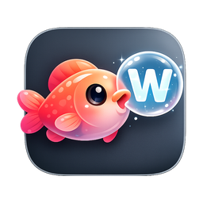

  

<h1 align="center">摸鱼背词</h1>

  <b>看起来在摸鱼，其实你在变强。</b>

---

 

> ⏺ 等编译的时候干嘛？刷手机？发呆？
>
> ⏺ 单词 App 打开又关，背了三天又忘了？
>
> ⏺ 想在工位悄悄学习，又怕老板路过看见？

**别装了。你需要摸鱼背词。**

透明悬浮窗悬在屏幕角落。没有大窗口，没有弹窗通知。路过你屏幕的人，什么都看不到。

- 左键复习，右键切词，长按三秒 —— 碎裂消失，这个词你拿下了。
- 七本内置词书 + 自定义拖入，每日计划自动拆好。你只管背。
- 从初中到 SAT，从发呆到背完整本词书，只差一个摸鱼窗口。

**把编译间隙还给大脑，把刷手机时间变成词汇量。**

 

  <a href="#-开始使用">开始使用</a>
  &nbsp;·&nbsp;
  <a href="#-功能">功能</a>
  &nbsp;·&nbsp;
  <a href="#-词书来源">词书</a>

 

## 开始使用

| 平台 | 下载 |
|------|------|
| macOS 11+ | [摸鱼背词.dmg](https://github.com/Neroxsh/moyu-words/releases/latest) |
| Windows 10+ | [MoyuWords.msi](https://github.com/Neroxsh/moyu-words/releases/latest) |

> 下载后直接安装即可。macOS 首次打开如提示"无法验证开发者"，前往 **系统设置 → 隐私与安全性** 点击"仍要打开"。

## 功能

- **摸鱼模式** — 透明置顶窗口，可拖拽缩放。路人视角：你在写代码
- **智能复习** — 左键上一词、右键下一词、长按 3 秒标记熟识并播放碎裂动画
- **学习计划** — 选一本词书，告诉它几天背完，自动帮你拆成每日单元
- **进度追踪** — 单元打卡、熟识词库、一键导出
- **词书自由** — 内置初中/高中/四级/六级/考研/托福/SAT，也支持拖入自己的 `.txt` `.csv` `.json`

## 词书来源

内置词书整理自 [KyleBing/english-vocabulary](https://github.com/KyleBing/english-vocabulary)。

## License

[MIT](LICENSE)